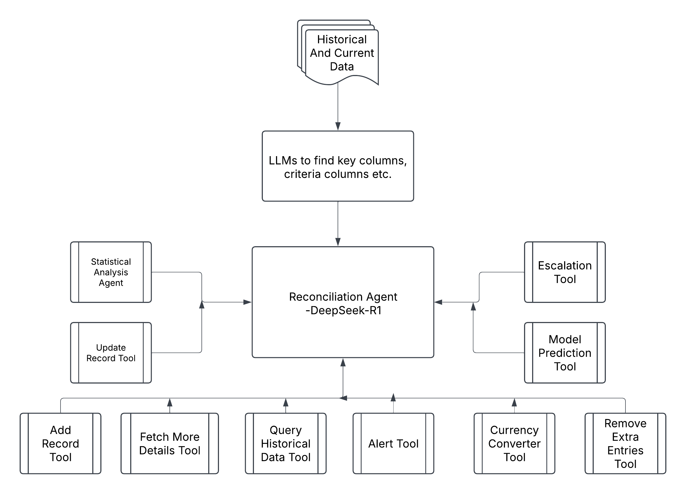

# Automated Reconciliation System Architecture

## Overview

A modular AI-powered reconciliation system that handles bank statement vs. book record matching with dynamic column detection, multi-agent analysis, and corrective actions.

## Key Features

-   **Dynamic Column Mapping** - LLM-based column detection
-   **Multi-Agent Analysis** - 12 specialized reconciliation tools
-   **Self-Healing Data** - Auto-correcting transactions
-   **Continuous Learning** - Feedback loop for model improvement
-   **Enterprise Security** - PII masking, audit trails

---

## Core Components

| Tool              | Purpose                    | Key Methods                                                |
| ----------------- | -------------------------- | ---------------------------------------------------------- |
| QueryTool         | SQL-style data exploration | `find_similar_transactions()`, `get_historical_patterns()` |
| StatTool          | Anomaly detection          | `calculate_zscore()`, `iqr_outlier_check()`                |
| AlertTool         | Threshold monitoring       | `amount_variance_alert()`, `frequency_alert()`             |
| CurrencyConverter | Forex handling             | `auto_adjust_rates()`, `historical_rate_lookup()`          |
| PredictionTool    | ML forecasting             | `fraud_probability()`, `timing_discrepancy_prediction()`   |
